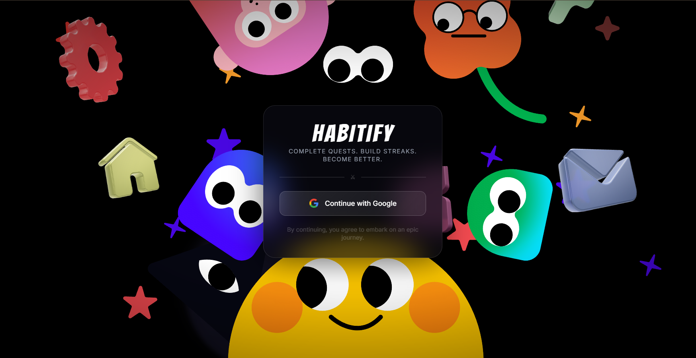
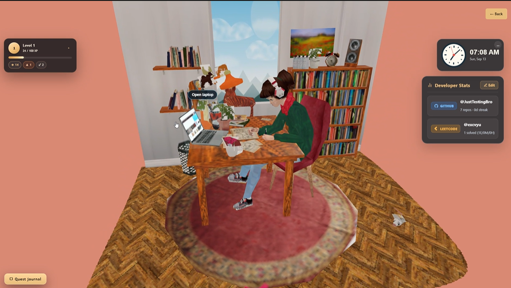
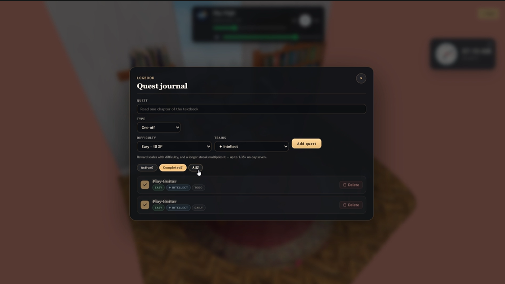
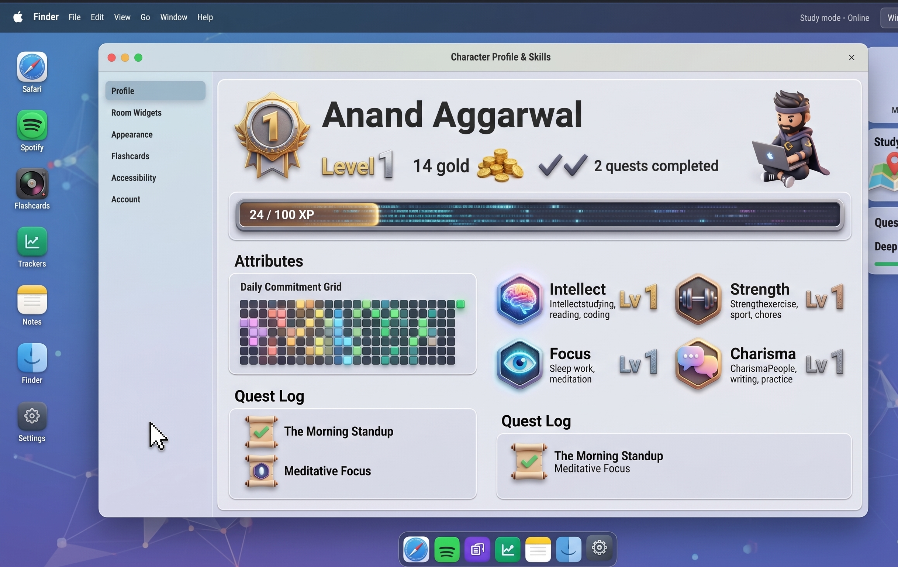

# Habitify — Level Up Your Life, One Habit at a Time

<p align="center">
  
</p>

<p align="center">
  <strong>Turn daily habits, todos, and coding activity into an RPG-style adventure.</strong>
</p>

<p align="center">
  A gamified productivity and habit-tracking web application designed to help you build consistency, complete daily quests, maintain streaks, and track your personal growth.
</p>

<p align="center">
  <a href="#features">Features</a> •
  <a href="#tech-stack">Tech Stack</a> •
  <a href="#project-structure">Project Structure</a> •
  <a href="#getting-started">Getting Started</a> •
  <a href="#roadmap">Roadmap</a>
</p>

---

## Preview

<p align="center">
  <strong>Habitify — Level Up Your Life, One Habit at a Time</strong>
</p>

<br />

<table align="center">
  <tr>
    <td align="center">
      
    </td>
    <td align="center">
      
    </td>
  </tr>
  <tr>
    <td align="center">
      
    </td>
    <td align="center">
      
    </td>
  </tr>
</table>

<p align="center">
  <em>
    A gamified productivity dashboard for habits, quests, streaks,
    and coding progress.
  </em>
</p>


### Demo
* **Demo Video:** `YOUR_DEMO_VIDEO_URL`
---

## About Habitify

Traditional habit trackers can quickly become repetitive. Habitify makes personal growth more engaging by turning everyday productivity into a game-like progression system.

With Habitify, users can:

* Create and complete daily habits
* Manage todos and recurring tasks
* Build and maintain streaks
* Track personal productivity
* Monitor GitHub activity
* Track LeetCode progress
* View their progress through an RPG-inspired dashboard

Every completed action represents progress toward becoming a better version of yourself.

> **Complete quests. Build streaks. Level up your life.**

---

## Features

### 🎯 Habit and Task Tracking

Create and manage different types of productivity activities:

* Daily habits
* One-time todos
* Recurring tasks
* Personal goals
* Daily quests

Tasks are stored per user using Firebase Firestore.

### 🔥 Streak Tracking

Build consistency by completing habits regularly.

Habitify helps users track:

* Current streaks
* Completed tasks
* Daily progress
* Productivity consistency
* Personal performance trends

### 🎮 RPG-Style Progression

Habitify turns daily productivity into an RPG-inspired progression system.

The experience is designed around:

* Character-style statistics
* Daily missions
* Progress tracking
* Achievement-based goals
* Level-up inspired feedback
* Future XP and reward systems

### 💻 GitHub Integration

Connect a GitHub username and view public developer activity, including:

* Repository count
* Contribution activity
* Contribution streak
* Developer progress

### 🧩 LeetCode Integration

Track competitive programming progress using public LeetCode statistics, including:

* Problems solved
* Contest ranking
* Coding activity
* Problem-solving progress

### 🔐 Firebase Authentication

Habitify supports secure authentication through Firebase:

* Email and password login
* Google authentication
* Protected routes
* Backend token verification
* User-specific data access

### 📊 Productivity Dashboard

View important productivity information in one place:

* Habits
* Todos
* Daily quests
* Streaks
* RPG statistics
* GitHub activity
* LeetCode statistics

### 🌌 Interactive Productivity Experience

Habitify is designed to feel more like an interactive productivity world than a traditional checklist application.

The planned experience includes:

* Interactive rooms
* Laptop-based productivity tools
* Focus and music experiences
* AI-powered writing tools
* Quest Journal
* Coding progress tracking

---

## Tech Stack

### Frontend

* React
* Vite
* JavaScript
* CSS
* Firebase Client SDK

### Backend

* Node.js
* Express.js
* Firebase Admin SDK
* Cloud Firestore
* REST API

### Integrations

* GitHub public API
* LeetCode statistics service
* Firebase Authentication

### Development Tools

* npm
* Git
* GitHub
* Vite development server

---

## Application Architecture

```text
                         ┌─────────────────────┐
                         │        User         │
                         └──────────┬──────────┘
                                    │
                                    ▼
                         ┌─────────────────────┐
                         │ React + Vite App    │
                         ├─────────────────────┤
                         │ Authentication      │
                         │ Dashboard           │
                         │ Habits and Todos    │
                         │ GitHub Integration  │
                         │ LeetCode Integration│
                         └──────────┬──────────┘
                                    │
                                    ▼
                         ┌─────────────────────┐
                         │ Express Backend API │
                         ├─────────────────────┤
                         │ Auth Middleware     │
                         │ Task Controllers    │
                         │ User Controllers    │
                         │ Integration Routes │
                         │ Error Middleware    │
                         └──────────┬──────────┘
                                    │
                                    ▼
                         ┌─────────────────────┐
                         │ Firebase Admin SDK  │
                         └──────────┬──────────┘
                                    │
                                    ▼
                         ┌─────────────────────┐
                         │   Cloud Firestore   │
                         └─────────────────────┘
```

---

## Project Structure

```text
life-rpg/
├── README.md
│
├── backend/
│   ├── package.json
│   ├── package-lock.json
│   ├── README.md
│   ├── .env.example
│   ├── .env                 # local only, ignored
│   ├── .gitignore
│   │
│   └── src/
│       ├── app.js
│       ├── server.js
│       │
│       ├── config/
│       │   └── firebaseAdmin.js
│       │
│       ├── controllers/
│       │   ├── integrationController.js
│       │   ├── taskController.js
│       │   └── userController.js
│       │
│       ├── middleware/
│       │   ├── authMiddleware.js
│       │   └── errorMiddleware.js
│       │
│       ├── routes/
│       │   ├── authRoutes.js
│       │   ├── integrationRoutes.js
│       │   ├── taskRoutes.js
│       │   └── userRoutes.js
│       │
│       └── services/
│           ├── githubService.js
│           ├── leetcodeService.js
│           └── userService.js
│
└── frontend/
    ├── package.json
    ├── package-lock.json
    ├── README.md
    ├── index.html
    ├── vite.config.js
    ├── .env.example
    ├── .env                 # local only, ignored
    │
    ├── public/
    │   └── logo.png
    │
    └── src/
        ├── App.jsx
        ├── App.css
        ├── index.css
        ├── main.jsx
        │
        ├── assets/
        │
        ├── components/
        │   ├── AuthForm.jsx
        │   ├── IntegrationsPanel.jsx
        │   ├── ProtectedRoute.jsx
        │   ├── PublicRoute.jsx
        │   └── SplineScene.jsx
        │
        ├── context/
        │   └── AuthContext.jsx
        │
        ├── lib/
        │   ├── api.js
        │   └── firebase.js
        │
        └── pages/
            ├── Dashboard.jsx
            ├── Login.jsx
            └── Register.jsx
```

---

## Getting Started

### Prerequisites

Install the following before running Habitify:

* Node.js 18 or higher
* npm
* Git
* A Firebase project
* Firebase Authentication
* Cloud Firestore

### 1. Clone the Repository

```bash
git clone https://github.com/bismay70/Zephyr-4.0-Team-Chernobyl.git
cd Zephyr-4.0-Team-Chernobyl/life-rpg
```

### 2. Install Backend Dependencies

```bash
cd backend
npm install
```

Create the backend environment file:

```bash
cp .env.example .env
```

Add the required Firebase Admin credentials and backend configuration.

### 3. Install Frontend Dependencies

Open a new terminal:

```bash
cd frontend
npm install
```

Create the frontend environment file:

```bash
cp .env.example .env
```

Add your Firebase client configuration and backend API URL.

### 4. Start the Backend

From the `backend/` directory:

```bash
npm run dev
```

### 5. Start the Frontend

From the `frontend/` directory:

```bash
npm run dev
```

Open the local URL provided by Vite in your browser.

---

## Environment Variables

### Backend Environment

Create `backend/.env` using `backend/.env.example`.

```env
PORT=5000
CLIENT_URL=http://localhost:5173

FIREBASE_PROJECT_ID=your_firebase_project_id
FIREBASE_CLIENT_EMAIL=your_firebase_client_email
FIREBASE_PRIVATE_KEY="your_firebase_private_key"
```

### Frontend Environment

Create `frontend/.env` using `frontend/.env.example`.

```env
VITE_API_URL=http://localhost:5000/api

VITE_FIREBASE_API_KEY=your_firebase_api_key
VITE_FIREBASE_AUTH_DOMAIN=your_firebase_auth_domain
VITE_FIREBASE_PROJECT_ID=your_firebase_project_id
VITE_FIREBASE_STORAGE_BUCKET=your_firebase_storage_bucket
VITE_FIREBASE_MESSAGING_SENDER_ID=your_firebase_messaging_sender_id
VITE_FIREBASE_APP_ID=your_firebase_app_id
```

Never commit `.env` files or Firebase private keys to GitHub.

---

## Firebase Setup

1. Create a project in Firebase Console.
2. Enable Email/Password authentication.
3. Enable Google authentication if required.
4. Create a Cloud Firestore database.
5. Register a web application.
6. Copy the Firebase client configuration.
7. Generate Firebase Admin credentials.
8. Add the Admin credentials to `backend/.env`.
9. Configure Firestore security rules for your application.

---

## API Overview

The backend provides REST endpoints for authentication, users, tasks, and external integrations.

| Area           | Responsibility                                        |
| -------------- | ----------------------------------------------------- |
| Authentication | Verify Firebase ID tokens                             |
| Users          | Store and retrieve user information                   |
| Tasks          | Create, update, complete, and delete habits and todos |
| Integrations   | Save GitHub and LeetCode usernames                    |
| Statistics     | Retrieve public coding activity                       |
| Error Handling | Provide centralized API error responses               |

Relevant backend files:

```text
backend/src/routes/
backend/src/controllers/
backend/src/services/
```

---

## Security

Habitify uses a user-specific data model:

* Firebase handles authentication.
* The backend verifies Firebase ID tokens.
* Tasks are stored per authenticated user.
* Protected routes restrict access to user data.
* Environment files are excluded from version control.
* GitHub and LeetCode information is retrieved from public data sources.

Do not expose Firebase Admin credentials in the frontend or commit private keys to the repository.

---

## Screenshots and Assets

The README uses a single 4-image collage placeholder.

Create the following directory:

```text
docs/
└── screenshots/
    ├── landing-page.png
    ├── dashboard.png
    ├── habit-tracking.png
    ├── coding-integrations.png
    └── habitify-collage.png
```

The final collage should contain:

```text
┌─────────────────────────┬─────────────────────────┐
│                         │                         │
│     Landing Page        │       Dashboard         │
│                         │                         │
├─────────────────────────┼─────────────────────────┤
│                         │                         │
│    Habit Tracking       │   Coding Integrations   │
│                         │                         │
└─────────────────────────┴─────────────────────────┘
```

The main README preview loads:

```text
docs/screenshots/habitify-collage.png
```

---

## Roadmap

* [ ] XP and level system
* [ ] Achievements and badges
* [ ] Habit completion animations
* [ ] Confetti and reward feedback
* [ ] Daily quest generation
* [ ] Custom RPG attributes
* [ ] Interactive room environment
* [ ] In-app music and focus mode
* [ ] AI-powered writing pad
* [ ] Productivity analytics
* [ ] Leaderboards
* [ ] Mobile-responsive improvements
* [ ] Progressive Web App support
* [ ] Notifications and reminders

---

## Contributing

Contributions, suggestions, and improvements are welcome.

1. Fork the repository.
2. Create a feature branch.

```bash
git checkout -b feature/your-feature
```

3. Commit your changes.

```bash
git commit -m "Add your feature"
```

4. Push your branch.

```bash
git push origin feature/your-feature
```

5. Open a pull request.

---

## License

Add your preferred license here.

Example:

```text
MIT License
```

---

## Team

Built by **Team Chernobyl** for **Zephyr 4.0**.

* **Product:** Habitify
* **Repository:** Life RPG
* **Category:** Gamified Productivity and Habit Tracking
* **Frontend:** React and Vite
* **Backend:** Node.js and Express
* **Database:** Firebase Firestore
* **Authentication:** Firebase Authentication

---

<p align="center">
  <strong>Habitify — Level Up Your Life, One Habit at a Time.</strong>
</p>

<p align="center">
  Make progress. Complete quests. Build better habits.
</p>
